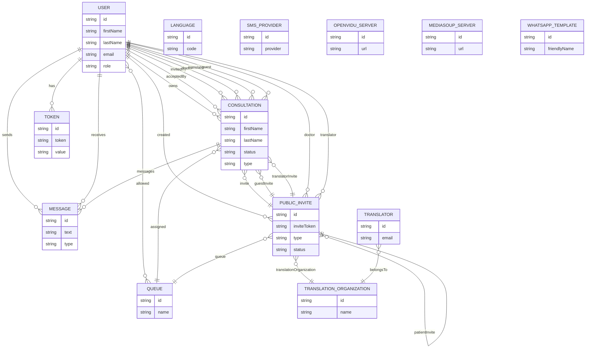

# Database ERD

The following diagram describes the main entities and relationships used in the backend application.

```mermaid
erDiagram
    USER {
        string id
        string firstName
        string lastName
        string email
        string role
    }

    CONSULTATION {
        string id
        string firstName
        string lastName
        string status
        string type
    }

    MESSAGE {
        string id
        string text
        string type
    }

    QUEUE {
        string id
        string name
    }

    PUBLIC_INVITE {
        string id
        string inviteToken
        string type
        string status
    }

    TOKEN {
        string id
        string token
        string value
    }

    TRANSLATION_ORGANIZATION {
        string id
        string name
    }

    TRANSLATOR {
        string id
        string email
    }

    LANGUAGE {
        string id
        string code
    }

    SMS_PROVIDER {
        string id
        string provider
    }

    OPENVIDU_SERVER {
        string id
        string url
    }

    MEDIASOUP_SERVER {
        string id
        string url
    }

    WHATSAPP_TEMPLATE {
        string id
        string friendlyName
    }

    USER ||--o{ CONSULTATION : owns
    USER ||--o{ MESSAGE : sends
    USER ||--o{ MESSAGE : receives
    USER }o--o{ QUEUE : allowed
    USER ||--o{ TOKEN : has
    USER ||--o{ PUBLIC_INVITE : created

    CONSULTATION }o--|| USER : acceptedBy
    CONSULTATION }o--|| USER : invitedBy
    CONSULTATION }o--|| USER : doctor
    CONSULTATION }o--|| USER : translator
    CONSULTATION }o--|| USER : guest
    CONSULTATION }o--|| QUEUE : assigned
    CONSULTATION }o--|| PUBLIC_INVITE : invite
    CONSULTATION }o--|| PUBLIC_INVITE : guestInvite
    CONSULTATION }o--|| PUBLIC_INVITE : translatorInvite
    CONSULTATION ||--o{ MESSAGE : messages

    PUBLIC_INVITE }o--|| USER : doctor
    PUBLIC_INVITE }o--|| USER : translator
    PUBLIC_INVITE }o--|| QUEUE : queue
    PUBLIC_INVITE }o--|| PUBLIC_INVITE : translatorRequestInvite
    PUBLIC_INVITE }o--|| PUBLIC_INVITE : translatorInvite
    PUBLIC_INVITE }o--|| PUBLIC_INVITE : guestInvite
    PUBLIC_INVITE }o--|| PUBLIC_INVITE : patientInvite
    PUBLIC_INVITE }o--|| TRANSLATION_ORGANIZATION : translationOrganization

    TRANSLATOR }o--|| TRANSLATION_ORGANIZATION : belongsTo
```
